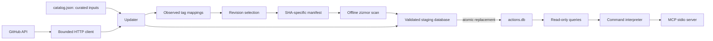

# Architecture

## Data flow

The curated catalog and machine discovery registry define membership; curated entries override discoveries, and explicit exclusions override both. SQLite carries the updater's observation history. A compressed, versioned JSON feed carries the same validated records for clients. Inputs, database, and feed are validated for agreement and published in one Git commit. The server reads only SQLite for local discovery. `man` and `audit` fetch the selected immutable SHA through the same HTTP adapter used by the updater.

## Modules

| Module | Responsibility |
| --- | --- |
| `models.py` | Validated catalog, revision, observation, manifest, and scan models; eligibility rules |
| `github.py` | Timeouts, bounded retries, pagination, authentication/rate-limit/error distinctions |
| `security.py` | Manifest parsing, versioned scanner JSON contract, one severity policy |
| `discovery.py` | Bounded candidate admission, exclusions, and source provenance |
| `feed.py` / `client_updates.py` | Portable data validation and background atomic client caching |
| `health.py` | Publication age, observation coverage, scan failures, editorial review queue |
| `updater.py` | Refresh orchestration and observation-based revision selection |
| `snapshot.py` | Schema, deterministic indexing, validation, atomic publication |
| `versions.py` | Read-only search and SHA-pinned usage rendering |
| `commands.py` | Parsing, typed action identities, control flow, and presentation |
| `server.py` | MCP transport and protocol error handling |

## Revision selection

Each numeric stable-looking tag records its dereferenced commit SHA, `first_seen`, and `last_seen`. A changed mapping starts a new window. Tags absent from a complete observation are removed from the observation map, so reappearance also starts a new window. An incomplete paginated response does not replace observations. Numeric tags explicitly marked prerelease or draft by GitHub Releases are not selected; tags without a GitHub Release are allowed.

Every successful repository refresh enumerates tags; checking that the current tag remains unchanged never suppresses discovery of newer tags. A mapping becomes eligible when it is observed again at least seven days after its first observation. Release dates and commit dates do not contribute to this gate. Selection does not silently downgrade while a newer or moved tag is waiting. A previously selected SHA remains immutable and usable according to its own scan evidence while a moved tag's new SHA waits.

Polling proves the mapping at observation times, not continuously. A tag moved away and back between observations may escape detection. This is why consumer snippets pin a full SHA. The observation gate is a delay and change-detection mechanism, not a guarantee that a repository or commit is trustworthy.

## Security policy

The scanner is pinned in the development dependencies and `models.SCANNER_VERSION` and runs with `--offline --strict-collection --format=json-v1`. No repository code is executed. Offline manifest analysis avoids scanner network calls and makes the policy repeatable. It cannot audit referenced code, dependencies, images, remote reputation, or vulnerabilities discoverable only through online checks. The exact available audit scope follows [zizmor's documentation](https://docs.zizmor.sh/usage/).

High severity maps to `error`, low/medium to `warning`, and informational to `info`. There are no organization-specific suppressions. Only exit codes for successful audits or documented findings are accepted; malformed or empty output, unsupported versions/severities, collection failures, and timeouts are errors.

A successful scan records SHA, scanner version, policy version, time, and normalized findings. The last attempt error is stored separately. Known blocking findings for the same SHA survive failed rescans. Prior clean findings do not turn a failed attempt into success. Selecting a different SHA invalidates both manifest and scan evidence. Missing evidence is `unknown`; evidence over fourteen days old or from an older/incompatible scanner or different policy version is `stale`. Normal refreshes rescan after seven days, on SHA/policy/scanner changes, or after failure.

Search and tag discovery exclude known blocked revisions. Other candidates remain discoverable with explicit statuses in their summaries. Usage snippets require an observed revision, its parsed manifest, and a fresh successful scan with no error findings. On-demand audits report current results but do not mutate the snapshot or bypass observation requirements.

## Failure and publication behavior

HTTP requests have per-operation timeouts, a 2 MB response cap, at most two retries for transport/server errors, and bounded backoff. Authentication errors and missing resources are distinct from transient failures. Rate limits stop further requests in that update's client. The next update starts with a new client and prioritizes records with the oldest successful check, preventing healthy early entries from consuming every run's budget.

Missing, archived, or inactive repositories retain their catalog entries. An inaccessible repository is not proof of deletion. Expected external failures preserve previous selections and observations and add an error status. Malformed records or programming errors abort the update before publication. Unexpected catalog changes during a run also abort publication.

The snapshot builder sorts records, validates identifiers and revision/evidence consistency, constructs SQLite and FTS in a temporary file, verifies integrity and content digests, and then publishes with one atomic rename. Readers open the database read-only and see either the old file or the replacement. A failed build leaves the previous snapshot intact. Rebuilding identical records produces identical database bytes on the same SQLite version; different SQLite versions can differ in internal layout while retaining identical content digests.

`update.py --check` verifies catalog membership and the feed/database record digest. One Git commit publishes the complete artifact set. Readers fetch one self-contained feed, never assemble state from independently fetched files. The daily workflow serializes update jobs and uses a normal fast-forward push. A concurrent commit causes rejection, requiring a fresh run rather than overwriting new curated inputs.

## Migration and freshness

Version 0.3 replaces the mixed `actions-metadata.json` input/output with `catalog.json` and a versioned SQLite snapshot. All 541 original entries and historical SHA pins were retained. Historical clean claims and manifest-derived fields without reliable provenance were discarded. The 62 historical blocks remain conservative evidence tagged with an unknown legacy scanner version and are eligible for immediate rescan.

Imported references have `unverified` stability. They require actual observations under the new gate before usage generation is enabled. No timestamps are backdated to fabricate observation history. Version 0.4 adds a schema-2 portable feed and background refresh in the MCP process. Older executable code is not auto-replaced. A client accepts normalized evidence from newer scanner minor versions in the same major and policy; the actual live scanner still requires its pinned version. Unknown policies and incompatible scanner majors remain stale. See [operations](operations.md).
